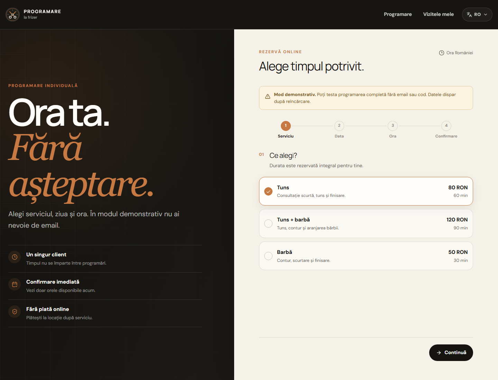
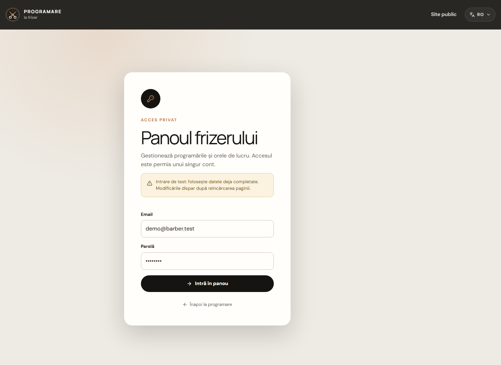

<div align="center">
  

  <h1>Barbershop Online</h1>

  <p><strong>A focused online booking experience for one independent barber.</strong></p>
  <p>Choose a service, pick an available time, confirm by email, and manage the appointment — without marketplace clutter.</p>

  <p>
    <a href="https://kaerna-group.github.io/barbershop-online/"><strong>Open the live demo</strong></a>
    ·
    <a href="RUNBOOK.md">Production runbook</a>
  </p>

  <p>
    
    
    
    
    
  </p>
</div>

## Preview

<p align="center">
  
</p>

<p align="center">
  
</p>

## Product

Barbershop Online is intentionally small in scope: one barber, one address, and one clear booking journey. It is not a salon marketplace, CRM, payment platform, or staff-management system.

The interface is available in Romanian, English, and Russian. Romanian is the default language, and the selected language is stored in a cookie. The visual identity uses typography, a graphite palette, and warm copper accents instead of photography.

### Customer experience

- Four-step booking flow: service → date → time → confirmation.
- Passwordless email OTP verification through Supabase Auth.
- Upcoming and past appointment history.
- Self-service rescheduling and cancellation within the configured rules.
- Localized dates, times, prices, validation, and status messages.
- Responsive and keyboard-accessible interactions.

### Owner experience

- Private sign-in for the single barber.
- Daily calendar and appointment status management.
- Manual bookings and unavailable-time blocks.
- Weekly working hours with multiple intervals per day.
- Date-specific schedule exceptions.
- Editable services, contact details, and booking rules.

### Reliability and security

- PostgreSQL exclusion constraints prevent overlapping appointments.
- Transactional RPCs handle booking, cancellation, and rescheduling.
- Idempotency keys make repeated requests safe.
- Row Level Security limits customers to their own appointments.
- The owner identity is stored in protected application settings.
- An email outbox supports confirmations, changes, cancellations, and reminders.

## Technology

| Area     | Technology                                 |
| -------- | ------------------------------------------ |
| Frontend | React 19, TypeScript, Vite, Tailwind CSS 4 |
| Routing  | React Router                               |
| Backend  | Supabase, PostgreSQL, Auth, Edge Functions |
| Quality  | Vitest, Testing Library, ESLint, Prettier  |
| Delivery | GitHub Actions, GitHub Pages               |

The source follows a lightweight feature-oriented structure:

```text
src/
├── app/       # application composition and routes
├── pages/     # page-level composition
├── features/  # complete user actions
└── shared/    # reusable UI, utilities, and infrastructure
```

Availability rules are authoritative on the server. The frontend presents available choices, while PostgreSQL and RPC functions validate every mutation again.

## Live demo

The published showcase currently runs in full mock mode so anyone can explore the complete interface without creating real users or changing the production database.

| Role     | Credentials                                           |
| -------- | ----------------------------------------------------- |
| Customer | No email or OTP required; enter only a name           |
| Owner    | <code>demo@barber.test</code> / <code>demo1234</code> |

Mock data lives only in the current browser tab and resets after a reload.

## Local development

```bash
npm ci
cp .env.example .env.local
npm run dev
```

The application starts in mock mode when Supabase variables are absent. To configure an environment explicitly:

```dotenv
VITE_SUPABASE_URL=https://PROJECT_REF.supabase.co
VITE_SUPABASE_PUBLISHABLE_KEY=sb_publishable_...
VITE_USE_MOCKS=true
```

When <code>VITE_USE_MOCKS=true</code>, the frontend never contacts Supabase, even if the URL and publishable key are present. Set it to <code>false</code> only after the database, owner account, email provider, and notification worker are ready.

## Supabase setup

1. Create separate Supabase projects for testing and production.
2. Authenticate and link the CLI:

   ```bash
   npx supabase login
   npx supabase link --project-ref YOUR_PROJECT_REF
   ```

3. Apply the versioned migrations:

   ```bash
   npx supabase db push
   ```

4. Review and load <code>supabase/seed.sql</code>.
5. Create the owner in Supabase Auth and assign the user's UUID to <code>app_settings.master_user_id</code>.
6. Configure passwordless email OTP and deploy the notification Edge Function.
7. Follow the complete [production runbook](RUNBOOK.md) before disabling mock mode.

The repository includes the six-digit OTP email template in <code>supabase/templates/magic_link.html</code>. Supabase projects using the default email service may require a custom SMTP provider before that template can be pushed.

Only the project URL and publishable key belong in the frontend. Service-role keys, email-provider tokens, and worker secrets must remain server-side.

## Commands

```bash
npm run check          # typecheck, tests, and production build
npm run lint           # ESLint
npm run format:check   # Prettier verification
npm run dev            # local development server
npm run preview        # preview the production build
```

## Routes

| Route                     | Purpose                                         |
| ------------------------- | ----------------------------------------------- |
| <code>/</code>            | Public booking flow and essential booking rules |
| <code>/my-bookings</code> | Appointments for the verified customer          |
| <code>/admin/login</code> | Private owner sign-in                           |
| <code>/admin</code>       | Calendar, schedule, services, and settings      |

GitHub Pages deep links are supported through the included SPA fallback.

## Default booking rules

- 30-minute start-time step.
- Minimum notice: 2 hours.
- Booking horizon: 30 days, including the last day.
- Customer cancellation or rescheduling: at least 12 hours before the visit.
- Maximum of 3 upcoming confirmed appointments per customer.
- Time zone: <code>Europe/Bucharest</code>.
- Currency: RON, stored in minor units.
- A new appointment may start exactly when the previous one ends.
- The owner may override customer limits, but never working hours or overlap protection.

## Production status

The Supabase schema, migrations, RLS policies, RPCs, Auth integration, and notification function are implemented. The public deployment remains a safe showcase until real owner data, a production email provider, server-side secrets, and launch checks are completed.

See [RUNBOOK.md](RUNBOOK.md) for the exact production activation and recovery procedure.
